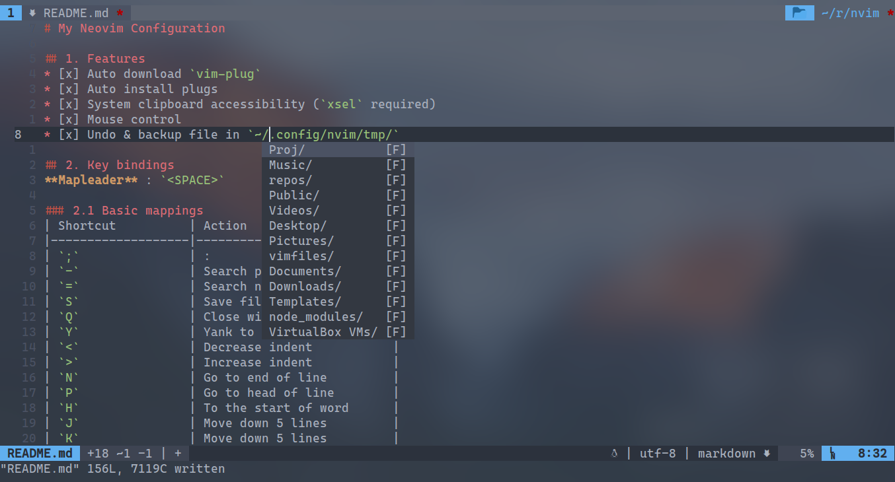

# My Neovim Configuration

## 1. Features
* [x] Auto download `vim-plug`
* [x] Auto install plugs
* [x] System clipboard accessibility (`xsel` required)
* [x] Mouse control
* [x] Undo & backup file in `~/.config/nvim/tmp/`

## 2. Key bindings
**Mapleader** : `<SPACE>`

### 2.1 Basic mappings
| Shortcut          | Action                  |
|-------------------|-------------------------|
| `;`               | :                       |
| `-`               | Search previous         |
| `=`               | Search next             |
| `S`               | Save file               |
| `Q`               | Close window            |
| `Y`               | Yank to the end of line |
| `<`               | Decrease indent         |
| `>`               | Increase indent         |
| `N`               | Go to end of line       |
| `P`               | Go to head of line      |
| `H`               | Move left 5 chars       |
| `J`               | Move down 5 lines       |
| `K`               | Move up 5 lines         |
| `L`               | Move right 5 chars      |
| `Alt` `n`         | Scroll 5 lines down     |
| `Alt` `p`         | Scroll 5 lines up       |
| `<LEADER>` `<CR>` | Close highlight         |

### 2.2 Window management
| Shortcut  | Action                            |
|-----------|-----------------------------------|
| `s`       | Unmapped                          |
| `s` `l`   | Split right                       |
| `s` `h`   | Split left                        |
| `s` `j`   | Split below                       |
| `s` `k`   | Split above                       |
| `g` `j`   | Move to window below              |
| `g` `k`   | Move to window above              |
| `g` `h`   | Move to window left               |
| `g` `l`   | Move to window right              |
| `<UP>`    | Increase height of current window |
| `<DOWN>`  | Decrease height of current window |
| `<LEFT>`  | Decrease width of current window  |
| `<RIGHT>` | Increase width of current window  |

### 2.3 Tab management
| Shortcut    | Action                 |
|-------------|------------------------|
| `t` `j`     | Create new tab left    |
| `t` `k`     | Create new tab right   |
| `t` `h`     | Go to the tab left     |
| `t` `l`     | Go to the tab right    |
| `t` `m` `h` | Move current tab left  |
| `t` `m` `l` | Move current tab right |

### 2.4 Terminal behaviors
While opening a new terminal, it will automatically switch to insert mode instead of normal mode.

| Shortcut           | Action                                         |
|--------------------|------------------------------------------------|
| `Ctrl` `q`         | Exit insert mode                               |
| `Ctrl` `o`         | Exit insert mode and return to last buffer     |
| `Ctrl` `h`         | Exit insert mode and go to the window left     |
| `Ctrl` `j`         | Exit insert mode and go to the window below    |
| `Ctrl` `k`         | Exit insert mode and go to the window above    |
| `Ctrl` `l`         | Exit insert mode and go to the window right    |
| `<LEADER>` `s` `t` | Open simple terminal at current work directory |
| `<LEADER>` `t` `y` | Open a new terminal window below               |

### 2.5 Insert mode cursor movement
| Shortcut   | Action                    |
|------------|---------------------------|
| `Ctrl` `a` | Move to the end of a line |

### 2.6 Command mode cursor movement
| Shortcut   | Action                |
|------------|-----------------------|
| `Ctrl` `a` | Go to start of a line |
| `Ctrl` `e` | Go to end of a line   |
| `Ctrl` `p` | Move cursor left      |
| `Ctrl` `n` | Move cursor right     |

### 2.7 Markdown mappings
In this configuration strings that looks like `<++>` are called "place holder"

| Shortcut | Action                              |
|----------|-------------------------------------|
| `,` `f`  | Delete next place holder and insert |
| `,` `b`  | Insert bold text                    |
| `,` `i`  | Insert italic text                  |
| `,` `w`  | Insert bold italic text             |
| `,` `d`  | Insert in-line code                 |
| `,` `c`  | Insert code block                   |
| `,` `s`  | Insert deleted text                 |
| `,` `p`  | Insert picture                      |
| `,` `a`  | Insert link                         |
| `,` `l`  | Insert separate line                |
| `,` `m`  | Insert TO-DO item                   |
| `,` `1`  | Insert #1 title                     |
| `,` `2`  | Insert #2 title                     |
| `,` `3`  | Insert #3 title                     |
| `,` `4`  | Insert #4 title                     |
| `,` `5`  | Insert #5 title                     |
| `,` `6`  | Insert #6 title                     |

Spell checking is automatically set while opening a markdown
file. The following key bindings are integrated by Vim but
it is necessary to list out.
| Shortcut | Action                                          |
|----------|-------------------------------------------------|
| `s` `[`  | Go to previous misspelled word                  |
| `s` `]`  | Go to next misspelled word                      |
| `z` `=`  | List all possible fixes to choose the right one |
| `z` `G`  | Mark current word as correct                    |

### 2.8 Other useful stuff
| Shortcut              | Action                                  |
|-----------------------|-----------------------------------------|
| `<LEADER>` `o`        | Open/close fold (same as `za`)          |
| `v` `v`               | Select a line (without `EOL`)           |
| `<LEADER>` `<LEADER>` | Delete next place holder and insert     |
| `<LEADER>` `s` `c`    | Toggle spell checking                   |
| `<LEADER>` `w` `p`    | Toggle wrap                             |
| `` ` ``               | Change case of current character        |
| `<LEADER>` `f`        | Generate ASCII image (`figlet`Required) |
| `\` `p`               | Show current work directory             |
| `<Alt>` `j`           | Move current line down                  |
| `<Alt>` `k`           | Move current line up                    |
| `<Alt>` `s`           | Show highlight group                    |
| `R`                   | Compile & Run                           |
| `<LEADER>` `r` `c`    | Open `$MYVIMRC`file                     |
| `Ctrl` `u`            | Change current word to upper case       |
| `b` `-`               | Go to previous buffer                   |
| `b` `=`               | Go to next buffer                       |

### 2.9 Quick surround
Most of these key bindings are available in visual mode.
| Shortcut | Action             |
|----------|--------------------|
| `"`      | Surround with `""` |
| `'`      | Surround with `''` |
| `}`      | Surround with `{}` |
| `]`      | Surround with `[]` |
| `0`      | Surround with `()` |
| `>`      | Surround with `<>` |
| `t`      | Surround with tag  |
| `a` `0`  | Select whole `()`  |
| `i` `0`  | Select inner `()`  |
| `ds0`    | Delete `()`        |

### 2.10 Screen shots

