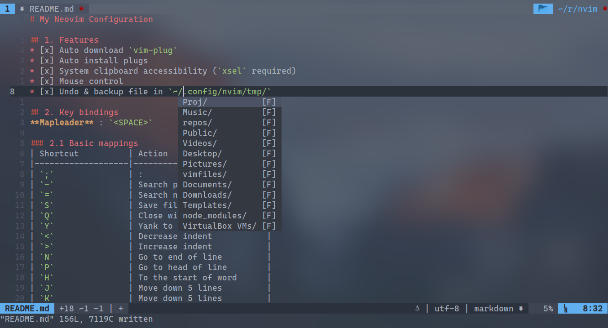

# Neovim配置

## 1.特性
* [x] 自动下载
* [x] 自动扩展安装
* [x] 系统剪贴板访问性(需要`xsel`)
* [x] 鼠标控制
* [x] 撤销&备份文件位于`~/.config/nvim/tmp/`

## 2.按键绑定
**Leader键** : `<SPACE>`

### 2.1 基础绑定
| 键绑定            | 动作             |
|-------------------|------------------|
| `;`               | :                |
| `-`               | 向前查找         |
| `=`               | 向后查找         |
| `S`               | 保存文件         |
| `Q`               | 关闭窗口         |
| `Y`               | 复制至行尾       |
| `<`               | 缩进递增         |
| `>`               | 缩进递减         |
| `N`               | 跳转至行尾       |
| `P`               | 跳转至行首       |
| `H`               | 向左移动五个字符 |
| `J`               | 向下移动五行     |
| `K`               | 向上移动五行     |
| `L`               | 向右移动五个字符 |
| `Alt` `n`         | 向下滚动五行     |
| `Alt` `p`         | 向上滚动五行     |
| `<LEADER>` `<CR>` | 关闭搜索高亮     |

### 2.2 窗口管理
| 键绑定    | 动作             |
|-----------|------------------|
| `s`       | 取消绑定(无动作) |
| `s` `l`   | 向右分割         |
| `s` `h`   | 向左分割         |
| `s` `j`   | 向下分割         |
| `s` `k`   | 向上分割         |
| `g` `j`   | 移动至下方窗口   |
| `g` `k`   | 移动至上方窗口   |
| `g` `h`   | 移动至左侧窗口   |
| `g` `l`   | 移动至右侧窗口   |
| `<UP>`    | 窗口高度递增     |
| `<DOWN>`  | 窗口高度递减     |
| `<LEFT>`  | 窗口宽度递减     |
| `<RIGHT>` | 窗口宽度递增     |

### 2.3 标签页管理
| 键绑定      | 动作                 |
|-------------|----------------------|
| `t` `j`     | 在左侧创建新的标签页 |
| `t` `k`     | 在右侧创建新的标签页 |
| `t` `h`     | 切换至左侧标签页     |
| `t` `l`     | 切换至右侧标签页     |
| `t` `m` `h` | 将当前标签页向左移动 |
| `t` `m` `l` | 将当前标签页向右移动 |

### 2.4 终端模式行为
当打开一个新的终端窗口时会自动进入插入模式而不是正常模式
| 键绑定             | 动作                                        |
|--------------------|---------------------------------------------|
| `Ctrl` `q`         | 退出插入模式                                |
| `Ctrl` `o`         | 退出插入模式并返回前一个缓冲区              |
| `Ctrl` `h`         | 退出插入模式并跳转至左侧窗口                |
| `Ctrl` `j`         | 退出插入模式并跳转至下方窗口                |
| `Ctrl` `k`         | 退出插入模式并跳转至上方窗口                |
| `Ctrl` `l`         | 退出插入模式并跳转至右侧窗口                |
| `<LEADER>` `s` `t` | 在当前工作目录打开Simple Terminal(单独进程) |
| `<LEADER>` `t` `y` | 在下方打开新的终端窗口                      |

### 2.5 插入模式光标移动
| 键绑定     | 动作       |
|------------|------------|
| `Ctrl` `a` | 移动到行尾 |

### 2.6 命令模式光标移动
| 键绑定     | 动作       |
| `Ctrl` `a` | 移动到行首 |
| `Ctrl` `e` | 移动到行尾 |
| `Ctrl` `p` | 向左移动   |
| `Ctrl` `n` | 向右移动   |

### 2.7 Markdown 键绑定
在该配置中形似``的字符串称为"占位符"
| 键绑定  | 动作                           |
|---------|--------------------------------|
| `,` `f` | 删除下一个占位符并进入插入模式 |
| `,` `b` | 插入粗体文字                   |
| `,` `i` | 插入斜体文字                   |
| `,` `w` | 插入粗斜体文字                 |
| `,` `d` | 插入行内代码                   |
| `,` `c` | 插入代码块                     |
| `,` `s` | 插入删除线文本                 |
| `,` `p` | 插入图片                       |
| `,` `a` | 插入链接                       |
| `,` `l` | 插入分割线                     |
| `,` `m` | 插入TODO项目                   |
| `,` `1` | 插入一级标题                   |
| `,` `2` | 插入二级标题                   |
| `,` `3` | 插入三级标题                   |
| `,` `4` | 插入四级标题                   |
| `,` `5` | 插入五级标题                   |
| `,` `6` | 插入六级标题                   |

拼写检查将在打开一个Markdown文件时自动开启。
以下的按键绑定已被Vim集成，但有必要列出。
| 键绑定  | 动作                           |
|---------|--------------------------------|
| `s` `[` | 跳转至上一个拼写错误的词语     |
| `s` `]` | 跳转至下一个拼写错误的词语     |
| `z` `=` | 列出所有可能的拼写修正以便选择 |
| `z` `G` | 将当前词语标记为无拼写错误     |

### 2.8 其他有用的玩意儿
| 键绑定                | 动作                           |
|-----------------------|--------------------------------|
| `<LEADER>` `o`        | 打开/关闭折叠(与`za`相同)      |
| `v` `v`               | 选择一行(不带行尾)             |
| `<LEADER>` `<LEADER>` | 删除下一个占位符并进入插入模式 |
| `<LEADER>` `s` `c`    | 切换拼写检查                   |
| `<LEADER>` `w` `p`    | 切换自动换行                   |
| `` ` ``               | 切换当前字符的大小写           |
| `<LEADER>` `f`        | 创建字符画(需要`figlet`)       |
| `\` `p`               | 显示当前工作目录               |
| `<Alt>` `j`           | 将当前行下移                   |
| `<Alt>` `k`           | 将当前行上移                   |
| `<Alt>` `s`           | 显示当前行的高亮组             |
| `R`                   | 编译&运行                      |
| `<LEADER>` `r` `c`    | 打开 `$MYVIMRC` 文件           |
| `Ctrl` `u`            | 将当前词语大写                 |
| `b` `-`               | 切换至前一个缓冲区             |
| `b` `=`               | 切换至后一个缓冲区             |

### 2.9 快速包裹
大部分的按键绑定在可视模式下均可用
| 键绑定  | 动作               |
|---------|--------------------|
| `"`     | 用双引号包裹       |
| `'`     | 用单引号包裹       |
| `}`     | 用大括号包裹       |
| `]`     | 用中括号包裹       |
| `0`     | 用小括号包裹       |
| `>`     | 用尖括号包裹       |
| `t`     | 用标签包裹         |
| `a` `0` | 选择包含括号的文本 |
| `i` `0` | 选择括号内部的文本 |
| `ds0`   | 删除括号           |

### 2.10 屏幕截图

